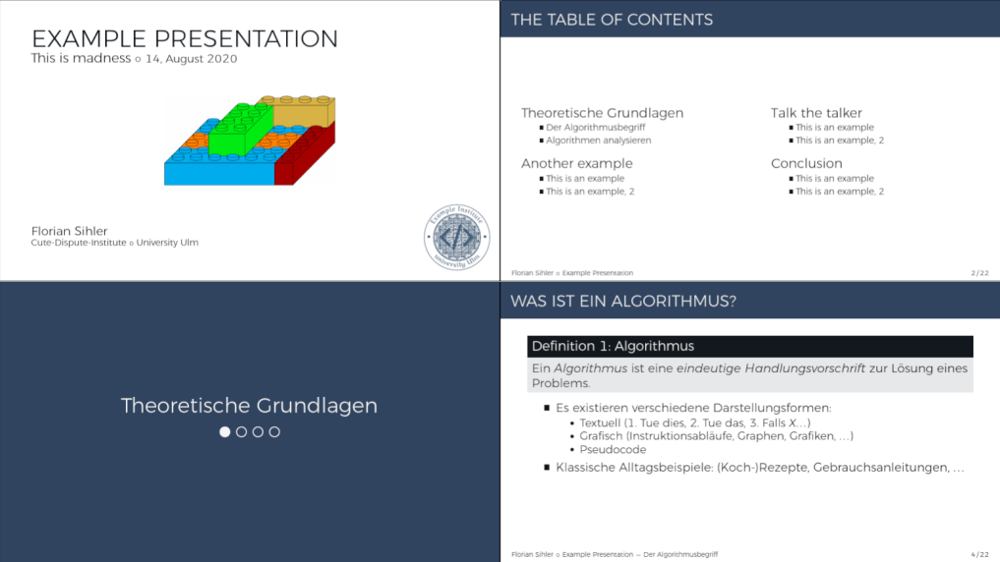

# beamer-themes

  

A hopefully growing collection of (latex) beamer-themes that i have created over the years.
All themes supplied are standalone versions but can be constructed via inner and outher themes if desired.

## General

Some resources are shared between all of the example-documents (they are just placeholders and therefore not necessary). If you compile the documents in place and do not replace those placeholders, you should copy the `example.bib` and the `exampletitleimage.png` in the same folder.

The example bibliography-file is based on an [overleaf-example](https://www.overleaf.com/learn/latex/Bibliography_management_in_LaTeX).

All preview images have been created with the bash-file [genpreview](genpreview) which uses `convert` and `montage` from imagemagick. Therefore some graphical effects might be based on a faulty conversion.

## digital-minimal

This theme is located [here](./digital-minimal) and _has_ BibLaTeX-Support.
Valid Options (defaults are marked):

- `footfade`/__`nofootfade`__ (automatic foot fading for sections)
- `primary-foot`/__`gray-foot`__ (only with `nofootfade`, highlights current section with primary in foot)
- `lightmode`/__`lightmode-fill`__/`darkmode`/`darkmode-soft` (switch default and internal color-themes)
- __`libs`__/`nolibs` (automatically load necessary libraries)
- __`small-triangle`__/`large-triangle` (switch between a smaller and a larger triangle for the upper right position)
- __`showbib`__/`nobib` (enable bibliography)

Another (up-to-date) example is located at [example.pdf](https://github.com/EagleoutIce/beamer-themes/blob/gh-pages/digital-minimal/example.pdf).

This is a new layout i work on to be used for my university presentations (it offers a darkmode).

## colorful-dream

This theme is located [here](./colorful-dream) and _has_ BibLaTeX-Support.
Valid Options (defaults are marked):

- `nofont`/__`font`__ (automatic font-loading)
- `nolibs`/__`libs`__ (automatic loading of other libraries like tikz)
- __`noemblem`__/`emblem` (place emblem on titlepage, configure the emblem with `\SetEmblem`)
- __`notheorems`__/`theorems` (automatic configuration of theorems. Will define "exercise" and "solve").
- `nobib`/__`showbib`__ (shows bibliography on the last slide; will only be shown if biblatex is setup).

Other configuration-options and commands like `\email` and `\outro` are presented in the [example.tex](colorful-dream/example.tex):

Another (up-to-date) example is located at [example.pdf](https://github.com/EagleoutIce/beamer-themes/blob/gh-pages/colorful-dream/example.pdf).

I have written this variant for a university presentation i did, a full example of this theme is to be found in the [repository](https://github.com/EagleoutIce/eidi-pseudo-rep20).

## lucy

This theme is located [here](./lucy) and _has_ BibLaTeX-Support. I've written this template for my abitur.
Valid Options (defaults are marked):

- `nofont`/__`font`__ (automatic font-loading. Loads the title-font too)
- `nolibs`/__`libs`__ (automatic loading of other libraries like tikz)

You must insert the title-page yourself, as seen in the [example.tex](lucy/example.tex):

Another (up-to-date) example is located at [example.pdf](https://github.com/EagleoutIce/beamer-themes/blob/gh-pages/lucy/example.pdf).

I use this layout (with different color themes) for my university presentations. An example is to be found with the [LaTeX-Slides](https://github.com/EagleoutIce/slides-latex-basics).

## fragment

This theme is located [here](./fragment) and _has_ BibLaTeX-Support. It is loosely based on my [sopra-seraphim](https://media.githubusercontent.com/media/EagleoutIce/sopra-collection/gh-pages/sopra-seraphim/sopra-seraphim.doc.pdf) class.
Valid Options (defaults are marked):

- `nofont`/__`font`__ (automatic font-loading. Loads the title-font too)
- `nolibs`/__`libs`__ (automatic loading of other libraries like tikz)

You must insert the title-page yourself, as seen in the [example.tex](fragment/example.tex):

Another (up-to-date) example is located at [example.pdf](https://github.com/EagleoutIce/beamer-themes/blob/gh-pages/fragment/example.pdf).

## dividing-lines

This theme is located [here](./dividing-lines) and _has_ BibLaTeX-Support.
Valid Options (defaults are marked):

- __`footfade`__/`nofootfade` (automatic foot fading for sections)
- __`nocenterfoot`__/`centerfoot` (automatically center foot)
- __`libs`__/`nolibs` (automatically load necessary libraries)
- __`bib`__/`nobib` (enable bibliography)

The title page is set automatically, as seen in the [example.tex](dividing-lines/example.tex):

Another (up-to-date) example is located at [example.pdf](https://github.com/EagleoutIce/beamer-themes/blob/gh-pages/dividing-lines/example.pdf).

I use this layout for my seminar presentation. It is to be found in the [repository](https://github.com/EagleoutIce/slides-rtds-trusting-trust).
